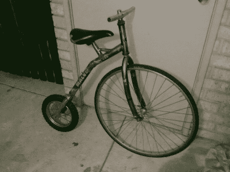

# 无链自行车会转几个头

> 原文：<https://hackaday.com/2011/08/02/chainless-bicycle-will-turn-a-few-heads/>

有人让[Tane]摆弄焊接设备和自行车零件，看看发生了什么！他制造了一辆小型自行车。现在，这只是一个人力驱动的陆地车辆的术语，但这个术语更合适，因为它缺少了你期望在自行车上看到的大部分东西。

他从一辆山地车和一辆踏板车开始，然后用一把锯子把它们都锯了。一点焊接和角度研磨，他留下了你在上面看到的。它仍然是可操纵的，但缺少曲柄，链条和刹车。不过没关系，自行车足够低，你的腿可以接触到地面——你启动它，然后像弗雷德·燧石族那样停下来。

[Tane]最初的意思是增加电力推进，但没有得到它。如果他有时间和动力，总是可以选择[给后轮](http://hackaday.com/2010/02/18/build-your-own-hub-motor/)加一个轮毂电机。