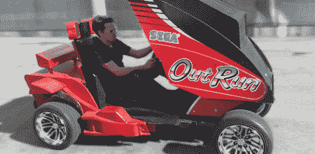

# 经典游戏柜成为可驾驶的汽车

> 原文：<https://hackaday.com/2011/08/02/classic-game-cabinet-becomes-a-drivable-car/>

加州大学欧文分校的教授兼“常驻艺术家”加内特·赫兹(Garnet Hertz)为一项增强现实的实验建造了一个可驾驶的游戏柜*和 T2 的游戏柜。*

旧的玻璃纤维和木制橱柜被砸碎，电动高尔夫球车的马达、轮子和传动系统被塞在里面。原来的方向盘和踏板用于控制。虽然游戏中汽车的最高速度大约是每小时 180 英里，但这被降低到了合理的每小时 13 英里。

该版本不能在最初的 68k 处理器上运行。相反，定制软件用于从橱柜顶部的两个网络摄像头获取真实世界的图像数据。这些图像然后被转换成*Outrun*sprite 并显示在监视器上。该软件按比例改变游戏中汽车的速度，但似乎游戏速度和现实生活速度之间的差异会有点令人不安。尽管这不是一条拥有*赛车*的[螺旋环](http://www.youtube.com/watch?v=7NmBel_ZgAk&w=470#t=101)的真实世界赛道，但它仍然是增强现实中一个有趣的实验。

现在，我们正在想办法把它放进我们的车里。*超越*正在进行[逆向工程](http://reassembler.blogspot.com/2011/07/outrun-controller-project.html)，[道路图层代码](http://reassembler.blogspot.com/2010/12/road-layer-and-slave-cpu-code-converted.html)完成。有人想尝试一下那栋建筑吗？

[https://www.youtube.com/embed/TaTB5Q11Dzc?version=3&rel=1&showsearch=0&showinfo=1&iv_load_policy=1&fs=1&hl=en-US&autohide=2&wmode=transparent](https://www.youtube.com/embed/TaTB5Q11Dzc?version=3&rel=1&showsearch=0&showinfo=1&iv_load_policy=1&fs=1&hl=en-US&autohide=2&wmode=transparent)