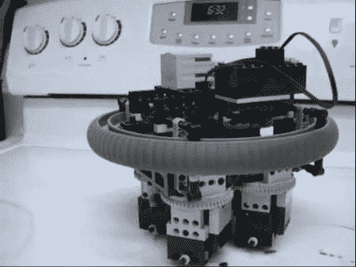

# 乐高同步驱动

> 原文：<https://hackaday.com/2011/08/04/the-lego-synchro-drive/>

[M 字节]写信告诉我们关于[乐高同步驱动](http://frog.instantfreesite.com/synchro/)。虽然不是一个新的黑客，但这种自动驾驶汽车的简单性令人惊叹。仅使用一个恒速转动的马达，该装置就能够通过简单的转动来通过障碍物。

正如[m-byte]很快指出的，这是一个使用现代电子设备的简单任务，但这个驱动器仅使用乐高技术部件制成。这台机器的运转很令人满意。当它碰到障碍物时，外部旋转环停止，允许底部的脚轮转换方向。人们可以看到这项发明出自列奥纳多·达·芬奇的笔记本(不包括乐高)。

休息后，请查看其中一个嵌入的视频，了解这款设备的运行情况。如果你想自己做一个，请点击[这个链接](http://frog.instantfreesite.com/synchro/)查看详细的说明。

 <https://www.youtube.com/embed/0p7OMVMWD3A?version=3&rel=1&showsearch=0&showinfo=1&iv_load_policy=1&fs=1&hl=en-US&autohide=2&wmode=transparent>

 <iframe class="youtube-player" width="800" height="480" src="https://www.youtube.com/embed/-uTApFE8H90?version=3&amp;rel=1&amp;showsearch=0&amp;showinfo=1&amp;iv_load_policy=1&amp;fs=1&amp;hl=en-US&amp;autohide=2&amp;wmode=transparent" allowfullscreen="true" style="border:0;" sandbox="allow-scripts allow-same-origin allow-popups allow-presentation"/> 
如果你想快速复习一下黑客技术的机械方面，看看这本<a href="http://hackaday.com/2011/03/09/mechanical-engineering-primer/">机械工程初级读本。</a>
 </body> </html>