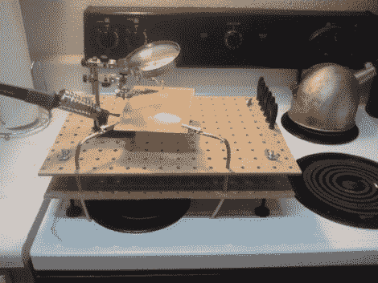

# 如何向您的焊接平台添加模块化工具

> 原文：<https://hackaday.com/2011/08/03/how-to-add-modular-tools-to-your-soldering-platform/>

[专利经济学]在他狭小的公寓里找不到合适的地方来开展项目。最近，他开始使用炉灶面作为焊接平台，并在寻找保护炉灶的方法，同时增加功能。他用几块钉板和一些五金店的零件搭建了这个焊接平台。他的价格不到 15 美元，拥有一个非常实用的平台，可能值得添加到您的焊接站中。

两块钉板由螺杆和一些螺母固定。这种硬件还可以调节支脚，这样您就可以使平台保持水平和稳定。顶板和底板上的孔排成一行，以容纳和固定一些附加工具。在这里，你可以看到可弯曲的铜管将一些鳄鱼夹保持在需要的地方，但未来的计划包括添加灯，夹子和激光。

这为你的[其他便携式电子工作台工具](http://hackaday.com/2011/08/01/how-to-take-a-travelling-electronics-lab-on-the-road-with-you/)提供了一个很好的工作平台。但是如果你真的感到痒，你最终会摆脱这一切，然后可能是时候[给自己找个黑客空间加入](http://hackaday.com/2011/01/27/mitch-altman-hosts-a-tour-of-noisebridge/)了。