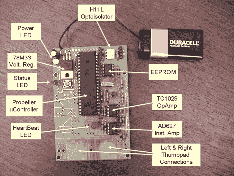

# 基于 DIY 螺旋桨的心电图

> 原文：<https://hackaday.com/2011/08/03/diy-propeller-based-ecg/>

[Ray]喜欢构建各种基于推进器的项目，但我们遇到的一个更有趣的项目是[这个 DIY ECG](http://www.rayslogic.com/propeller/Programming/PropEKG/PropEKG.htm) 。虽然我们之前已经[介绍过其他](http://hackaday.com/2009/08/22/collect-and-analyze-ecg-data/) [DIY 心电图](http://hackaday.com/2007/02/02/build-your-own-ecg-heart-monitor/)，但他留下了试验板，并为他的构建组装了一个制作精美的 PCB。

过去看过[我们的 ECG 承保范围](http://hackaday.com/2008/05/26/make-an-ecg-with-your-sound-card/)的人应该对 ECG 设计非常熟悉。用户将拇指放在大型内置垫上，这使得电路能够感应心脏收缩产生的电信号。这些微小的电脉冲随后通过仪表放大器 AD627 放大，然后通过双通道运算放大器进一步放大。

放大后的信号经过过滤，然后输入推进器的 ADC，ADC 通过 LED 显示用户的心律。数据也可以通过光隔离串行连接输入计算机。

[Ray]列出了在下载他的原理图和固件之前应该遵循的一系列警告和预防措施。我们必须回应这些警告，因为它不需要一个大的适当的电击来扰乱心脏。