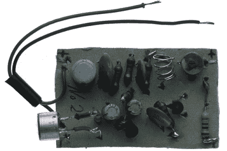

# 囚犯:世界上最不值得钦佩的黑客

> 原文：<https://hackaday.com/2011/08/04/prison-inmates-the-worlds-least-admirable-hackers/>

有一件事总是让我们感到惊讶，那就是囚犯们所展示的独创性，正如他们在法律的监督下创造的工具和武器所展示的那样。然而，与大多数人不同的是，这些人除了时间什么都没有，这使得他们不可避免地会想出各种各样的工具。

[马克·斯坦梅茨]花了一些时间拍摄了一些在各个监狱没收的违禁品。它们从相对温和的床单梯子到更复杂的物品，如由铁床柱制成的电池驱动的猎枪。虽然武器和逃生辅助设备是监狱院子里最常见的发明，但他还发现了一个 DIY 烤面包机、一个隐藏的无线电接收器，以及我们最喜欢的东西之一——上图中的监控窃听器，用于偷听警卫的谈话。

虽然在一个受控的监狱环境中使用任何这些物品都是值得怀疑的，但看看人们用有限的资源和大量的时间能黑出什么来还是很有趣的。

【经由 [Neatorama](http://www.neatorama.com/2011/08/04/15-unbelievable-inmate-escape-tools/) 经由[环境涂鸦](http://www.environmentalgraffiti.com/news-20-escape-tools-made-inmates)