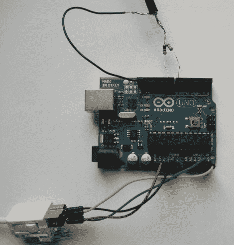

# 你想玩游戏吗？

> 原文：<https://hackaday.com/2011/08/04/would-you-like-to-play-a-game/>

[Itay]在我们的收件箱里放了一个关于[使用 Arduino](http://pragprog.com/magazines/2011-08/make-your-own-video-game-system)创建一个简单的视频游戏系统的链接。是的，我们都知道它的发展方向 Arduino 的电视输出库。然而，本教程仍然应该被提及，因为它几乎涵盖了新人快速轻松地连接这些东西所需的一切，以及 wii Nunchuck 的使用，库基础知识和创建您的第一个游戏。

包括大量的大图片、图表和软件解释。是的，我们知道我们经常使用这个小设置，那是因为它太有趣了。因此，如果你曾经想制作你自己的小视频游戏系统([而不是疯狂地用 ASM](http://hackaday.com/2011/03/02/gameduino/) 中的一个小微型设备敲打 VGA)，这个指南将帮助你开始制作下一个街机杰作。