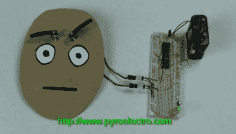

# 基础动画教程:基于 PIC 的伺服眉毛

> 原文：<https://hackaday.com/2011/08/05/basic-animatronics-tutorial-pic-based-servo-eyebrows/>

[Chris]来信让我们了解他最新的电子动画教程，这次是关于机器人眉毛的！本教程将带我们了解使用一个相当简单的 PIC 电路显示各种面部表情的过程。由于各种各样的面部表情都有独特且容易理解的眉毛位置，这个简单的技巧可以让最平淡无奇的面具变得栩栩如生。电子动画是一个贴近我们心灵的主题，但简单的伺服驱动比纸板脸走得更远。这个简单易懂的教程可以帮助你控制各种伺服系统，比如[通风口](http://hackaday.com/2010/10/10/add-on-panel-brings-automated-vents-flaps-to-a-pc/) [襟翼](http://hackaday.com/2007/04/27/diy-ac-zone-controls/)或者嗯……[鱼](http://hackaday.com/2009/10/17/polycarbonate-fish-uses-three-servos-to-swim/)，如果你愿意的话。该软件没有得到深入的解释，但它有注释，可以从[Chris]的网站下载。

从这里开始[Chris]计划用更多的教程来扩展这个项目，这些教程可以帮助进一步制作脸部动画。我们对他提到的单眼和双眼系统以及更复杂的眉毛结构特别感兴趣。也可以看看[克里斯]的其他基于伺服的机器人教程，如[夏普 Spotifier](http://www.pyroelectro.com/projects/sharpie_dotifier/) 和[木制威胁](http://www.pyroelectro.com/projects/robotic_arm/)。

休息之后还有眉毛在行动的视频。

 <https://www.youtube.com/embed/yoEkXngbcfE?version=3&rel=1&showsearch=0&showinfo=1&iv_load_policy=1&fs=1&hl=en-US&autohide=2&wmode=transparent>

 </body> </html>