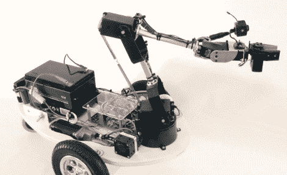

# 当你在沙发上放松时，机器人会照料你的草坪

> 原文：<https://hackaday.com/2011/08/05/robots-tends-your-lawn-while-you-veg-out-on-the-couch/>

大多数人都同意，除草并不好玩。[戴夫]不太喜欢坐在外面的大热天在草坪上辛勤劳作，所以他做了唯一合理的事情[，造了一个机器人替他做这件事](http://forums.parallax.com/showthread.php?132860-Nuntius-The-Garden-Avender-Robot-now-with-video)。

花园复仇者 Nuntius 是一个遥控机器人，[戴夫]可以在舒适的沙发上用它来除草。机器人由螺旋桨微控制器控制，通过一对 XBee 模块无线接收命令。Nuntius 的控制器非常直观，由一个 5 轴手臂组成，配有一个手爪，[戴夫]可以向任何方向铰接。他的动作使机器人的手臂同步移动，驱动 Nuntius 就像按住按钮并向所需方向移动控制器一样简单。

[Dave]可以通过安装在机器人手臂上的无线摄像头监控 Nuntius 在做什么，让他在机器人处理繁重工作时可以在室内休息放松。

请继续阅读，观看 Nuntius 的视频短片。

[通过[使](http://blog.makezine.com/archive/2011/08/garden-avenger-lets-you-pull-weeds-from-inside.html)

 <https://www.youtube.com/embed/RnZ_UmJkjqs?version=3&rel=1&showsearch=0&showinfo=1&iv_load_policy=1&fs=1&hl=en-US&autohide=2&wmode=transparent>

 </body> </html>