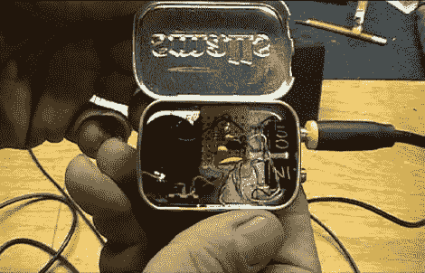

# 快速简单的音频前置放大器

> 原文：<https://hackaday.com/2011/08/06/quick-and-easy-audio-preamp/>

迪诺·塞戈维斯的最新一期《黑客一周》报道了一个简单的 NPN 晶体管音频前置放大器的构建。不久前，他用 LM386 制造了一个小型音频放大器[，效果很好，但没有让他的音乐达到他想要的音量。他决定构建一个前置放大器来补充他的放大器，并演示了如何只用少量元件就能构建一个前置放大器。](http://hackaday.com/2011/05/01/lm386-altoids-tin-amp/)

顾名思义，这个放大器的基石是一个 NPN 晶体管。他解释说，正向偏压施加在基极-发射极结上，导致晶体管工作在截止区和饱和区之间。输入音频信号的两半都叠加在该偏置电压上，从而在相对较小的封装中获得相当大的增益。

前置放大器不会在音响发烧友中赢得任何奖项，但它绝对是一个伟大的初学者项目。这是一种展示晶体管工作原理的新颖方式，同时也是一种实用的外卖音频设备。

继续阅读，看看一个视频，展示了(迪诺的)NPN 前置放大器对他的音乐有多大的影响。

 <https://www.youtube.com/embed/9SclQIWkOtk?version=3&rel=1&showsearch=0&showinfo=1&iv_load_policy=1&fs=1&hl=en-US&autohide=2&wmode=transparent>

 </body> </html>