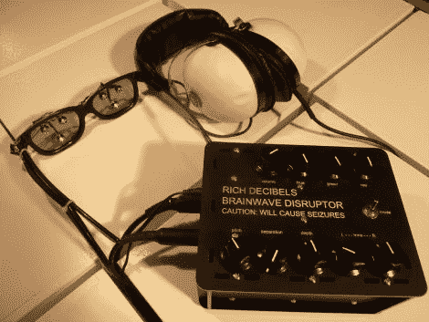

# 用脑电波干扰仪让你神魂颠倒

> 原文：<https://hackaday.com/2011/08/07/blow-your-mind-with-the-brainwave-disruptor/>

不管你相不相信，脑电波拖带背后的科学非常有趣。【丰富分贝】对这个课题产生了兴趣，在做了一些研究后，决定自己造一个[夹带装置。](http://blog.ponoko.com/2011/08/05/rich-decibels-brainwave-disruptor/)

如果你不熟悉这个概念，脑波夹带理论表明，低频光和声音可以用来改变大脑状态，其基础是假设人类大脑会改变其频率，以对应主导的外部刺激。[Rich]的设备与[Mitch Altman]的"[大脑机器](http://blog.makezine.com/archive/2007/05/hack-your-brain-make-vide.html)"非常相似，并使用这两种方法试图将用户置于一种改变的精神状态。

[Rich]在一套护目镜中安装了三个发光二极管，将它们与一套耳机一起连接到他的激光切割外壳。在内部，脑波干扰机包含一个 Arduino，它的任务是生成光模式以及位撞击音频流。

它是如何工作的？[Rich]报告说，它表现得相当好，导致视觉和听觉幻觉，同时完全丧失时间感。听起来很有趣，可以试一试！