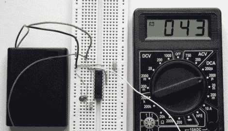

# 延长你的电路的电池寿命，让你的照片进入睡眠状态

> 原文：<https://hackaday.com/2011/08/09/stretch-your-circuits-battery-life-by-putting-your-pic-to-sleep/>

[Rajendra Bhatt]撰文分享了一系列 PIC 教程的最新内容，其中涵盖了[微控制器的睡眠模式](http://embedded-lab.com/blog/?p=3237)，这是一个非常有用的工具，可以限制电池供电应用中的电流消耗。

他讨论了如何将 PIC 置于睡眠模式，以及一些需要注意的常见错误，例如在睡眠时意外允许 I/O 引脚吸电流或流出电流。[Rajendra]还介绍了 PIC 脱离睡眠模式的各种方法，他的大部分教程都集中在 mcu 的看门狗定时器上。

使用 PIC16F628A，他构建了一个测试电路，该电路允许他演示使用睡眠模式而不是微控制器的内置延迟功能所获得的省电效果。该电路只是每 4.3 秒闪烁一次 LED，前 2.3 秒使用看门狗定时器，其余时间使用 delay()调用。

功率节省相当可观，类似于我们几周前看到的使用 AVR 微控制器的结果。【raje ndra】发现使用睡眠功能可以将电流消耗限制在调用 mcu 延迟功能时所用电流的 4.5%左右，这是一笔巨大的节省。