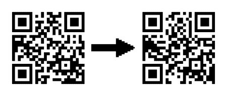

# 黑客二维码的乐趣和利润

> 原文：<https://hackaday.com/2011/08/09/hacking-qr-codes-for-fun-and-profit/>

如今，二维码无处不在，从印在收据上，到刻在花岗岩墓碑上。[威尔]想出了一种修改现有二维码的方法，他的黑客技术有可能造成一些无害的恶作剧。

[威尔]的黑客技术包括一些照片编辑、透明胶片和一些涂改液/液体纸/Tippex。将“目标”和“目的地”二维码导入 Gimp 后，即可发现差异，并将结果打印在透明纸上。之后，将透明胶片挂在原稿上，二维码就会转到你选择的网址。

在“高级”纠错层面上，[通过修改一个](http://mashable.com/2011/04/18/qr-code-design-tips/) [25×25 码](http://hackaday.com/wp-content/uploads/2011/08/hackaday.png)的 359 个“数据像素”,一个二维码的设计可以做很多巧妙的事情，包括[将标志](http://hackaday.com/wp-content/uploads/2011/08/creeper.png)放在二维码内。我们想知道是否有人编写过脚本来利用二维码的纠错功能。在任何情况下，都有可能强行改变，直到最少数量的像素被改变。

如果有人愿意接受挑战，可以在网上找到《ISO 18004 标准》。如果一个每日黑客读者发现了它，在[提示行](http://hackaday.com/contact-hack-a-day/)上发送代码，我们会把它放上去。