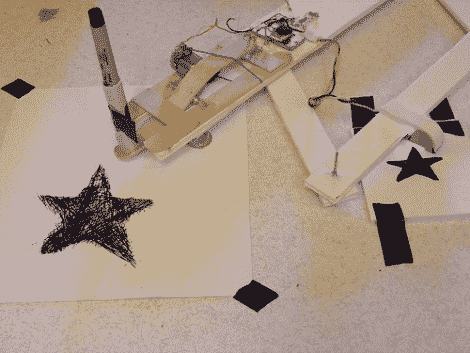

# 电子照相放大画图器为你画图

> 原文：<https://hackaday.com/2011/08/08/electrographic-enlarging-sketchifier-does-your-drawing-for-you/>

早在 80 年代，曾经有一种儿童玩具，可以让你通过在一个面板上描绘预先绘制的图片来复制图像，而机械臂则在另一个面板上放下墨水。我们很难记住这个东西叫什么，但是这个[电子照相放大素描器](http://www.flickr.com/photos/imajilon/5988698025/in/set-72157627187252201/)将会是一个非常棒的现代替身。

flickr 用户[Imajilon]用压舌板、铆钉、泡沫芯板和一些电子元件建造了这个很酷的电动受电弓。尽管它的廉价地下室材料清单，这东西是相当织补酷。光学传感器“观察”图像并驱动简单的 FET 电路，使用电驱动笔机制自动复制图像。

通过查看她的 flickr 流，我们认为结果相当令人印象深刻。她确实计划制作第二个版本的 Sketchifier，具有更小的光敏区域，这应该允许她解析源绘图的更小的特征。

[通过 [BuildLounge](http://buildlounge.com/2011/08/08/electrographic-enlarging-sketchifier/)