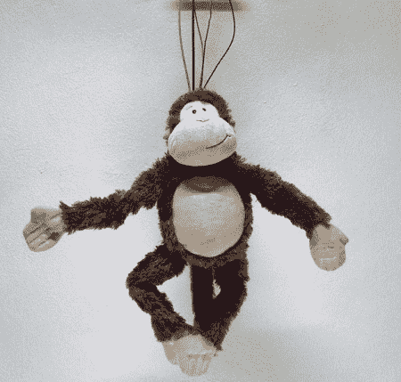

# 别瞎折腾了！

> 原文：<https://hackaday.com/2011/08/09/quit-monkeying-about/>

这只友好的小猴子是[Jan Sieber]和[Ralph Kistler]的最新作品。是的，这是另一个 Kinect 黑客，Kinect 使用 OpenNI 框架和 OSCeleton 跟踪用户的姿态。信息被发送到猴子体内的 Arduino，可怜的小猴子体内还有 10 个伺服电机和一个噩梦般的电线骨架。猴子被几根电缆吊在 Kinect 传感器上，随时准备跟随你的一举一动。对于一个内脏都被切除的人来说，这只猴子看起来相当活泼，它能够非常迅速地模仿多种姿势。

休息后的视频显示猴子在行动，大约 1 分钟。然后，该团队在一个音乐/纪录片风格的视频中检查了聪明的小猴子的构建和应用。还有一个令人毛骨悚然的部分，猴子画了自己的骨架，然后就抓狂了..享受..

 <https://www.youtube.com/embed/pWAud-9jNJY?version=3&rel=1&showsearch=0&showinfo=1&iv_load_policy=1&fs=1&hl=en-US&autohide=2&wmode=transparent>

 </body> </html>