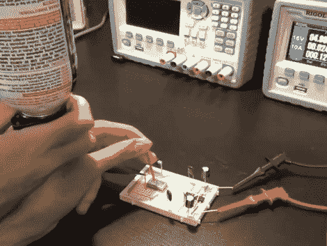

# 获得关于水晶的魔法知识

> 原文：<https://hackaday.com/2011/08/09/gain-wizardly-knowledge-about-crystals/>

确保你的测试设备在手边，然后[给这个关于晶体振荡器的视频系列一个旋转](http://thesignalpath.com/blogs/2011/08/08/frequency-generation-crystals-and-ring-oscillators/)。Signal Path 博客的[Shahriar]整理了一篇总共约一小时的四部分视频博文。在讨论中，他涵盖了晶体振荡器和环形振荡器的来龙去脉。他的重点是如何将这些部件用作微控制器的计时设备。这不是一个撇清主题表面的讲座，它带你进入兔子洞，讨论理论，设备是如何建造的，如何使用它们，以及这样做的陷阱。

我们最喜欢的部分是在第四部分，当[Shahriar]通过用倒置的压缩空气罐喷洒晶体来测量温度对晶体的影响。我们一直以为冷冻这样的东西只是在胡闹。我们没有想到我们正在进行严肃的实验。

休息之后我们嵌入了视频的第一段。[https://www.youtube.com/embed/yYGwfVnGAdg?version=3&rel=1&showsearch=0&showinfo=1&iv_load_policy=1&fs=1&hl=en-US&autohide=2&wmode=transparent](https://www.youtube.com/embed/yYGwfVnGAdg?version=3&rel=1&showsearch=0&showinfo=1&iv_load_policy=1&fs=1&hl=en-US&autohide=2&wmode=transparent)