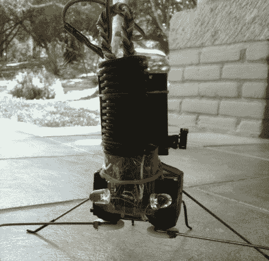

# 带有最少机械部件的“地核”六足机器人

> 原文：<https://hackaday.com/2011/08/09/an-earthcore-hexapod-with-minimal-mechanical-parts/>

虽然六足机器人已经在[HAD]上出现过很多次，但[这个](http://ijtoday.blogspot.com/2011/08/mechanical-crab-3-pics.html)采用了非常酷的简约设计。由于几乎没有机械部件来支持三个伺服系统，“地球核心六足机器人”具有独特的步态，倾向于快速滑动驱动腿，而不是抬起整个机器人。虽然它在崎岖的地形上可能会有困难，但在光滑的地板或柜台上使用，这个机器人非常适合。休息之后请看视频。

这个机器人上另一个真正引人注目的是蓝色的 LED“眼睛”和它的管状“帽子”“帽子”隐藏了三个伺服系统的线路，而大部分电路看起来在眼睛之间。主控制器是 PICAXE 18M2 微控制器。管道后面的 3 节 AAA 电池为该装置供电。

至于“地球核心”这个名字，它是基于斯科特·西格勒的一本书。如果有电影版在制作中，我们希望他打电话给【onefivefour】帮忙做特效！

 <https://www.youtube.com/embed/B2R0Vv34Wg4?version=3&rel=1&showsearch=0&showinfo=1&iv_load_policy=1&fs=1&hl=en-US&autohide=2&wmode=transparent>

 
对于另一个小的六足机器人项目，看看这个由透明塑料制成的机器人。
 </body> </html>