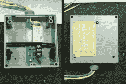
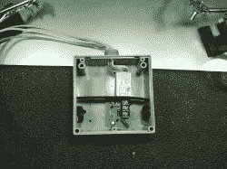
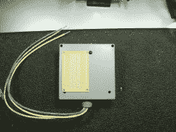
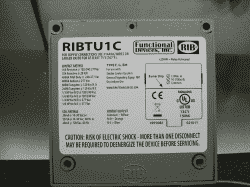

# 高压:使用封闭式继电器进行高压开关

> 原文：<https://hackaday.com/2011/08/19/using-enclosed-relays-for-hv-switching/>

在看过许多使用微控制器切换电源电压的项目后，Rob Miles 决定分享他的首选方法。你在上面看到的照片是一个封闭的继电器，零件号 RIBTU1C，由 Functional Devices Inc .制造。

这本身并不是他使用的完全控制方案，但它照顾到了硬件的大部分。他使用基于 555 定时器的触发电路。[Rob]提到如果您货比三家，您可以以低于 15 美元的价格获得继电器、555 定时器和其他组件。当你考虑到你有一个处理高电压的外壳和一个可以连接电源线路的好的端子板时，这是一个非常划算的解决方案。继电器本身可以通过控制电路中的晶体管由 9V 电池触发。

注意上图中的原型板。盒子内部有足够的空间放置驱动电路，受到高压电路隔离层的保护。休息之后看看他发给我们的其他照片。

