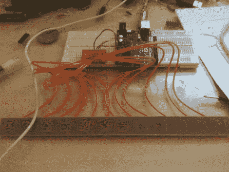

# 令人印象深刻的照明控制台以极低的价格提供专业功能

> 原文：<https://hackaday.com/2011/08/10/impressive-lighting-console-offers-professional-features-for-a-fraction-of-the-price/>

Hackaday 读者[Michael]来信分享了他已经工作了一段时间的令人印象深刻的灯光控制台的建造细节。他说，36+通道控制台与成本超过 5000 美元的照明设备不相上下，但他的控制台只花了大约 1000 美元——相当可观的节省。

该控制台是围绕一台旧的 IBM 台式计算机构建的，它处理所有的 DMX 输出以及预置管理。运行 Arduino bootloader 的 20 个 ATMega 328Ps 阵列分散在整个设备中，其中 18 个用于管理 6 个推子面板，而其余两个处理管理任务。除了推子组之外，控制台还配备了一个主控板，主控板上有几个 LCD 屏幕和 17 个电容式触摸按钮，用于菜单导航和控制台控制。

当[Michael]完成构建电路板时，他刚刚开始记录构建过程。他的博客应该会定期更新更多的细节，所以一定要经常回来看看。代码，以及希望吨的图片和视频都即将到来。

[编辑:成本比较更新]