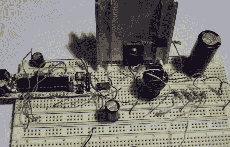

# DC 升压变换器简介

> 原文：<https://hackaday.com/2011/08/10/an-introduction-to-dc-boost-converters/>

如果你打算制作某种数码管显示器，你无疑需要给自己找一个高压 DC 电源。如果你不想在你的项目中添加变压器，你可以选择[来构建一个升压转换器，而不是](http://reibot.org/2011/08/07/intro-to-boost-converter/)。[Andrew Moser]向我们展示了构建一个简单的升压转换器是多么容易，同时讨论了简单升压转换器背后的理论。

升压转换器通常由专用 IC 驱动，但在这种情况下，来自 Arduino 的 PWM 信号可以很好地完成工作。[Andrew]介绍了为电路选择适当元件的过程，讨论了占空比和元件以避免升压转换器过早死亡。

他向我们展示了如何实现一个反馈系统来获得更精确的输出电压，但正如 [Lady Ada 向我们展示的](http://www.ladyada.net/library/diyboostcalc.html)，开环也非常有效。

对于那些只想让事情开始运行的初学者来说，他的说明和代码应该足够了，但是[Andrew]为那些希望更深入研究这个主题的人提供了大量参考链接。