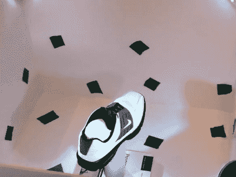

# 基于 Kinect 的转盘 3D 扫描仪看起来很有前景

> 原文：<https://hackaday.com/2011/08/10/kinect-based-turntable-3d-scanner-looks-very-promising/>

我们知道 Kinect 3D 摄像头硬件的出现，以及随后的开源驱动程序 hacking conquest，是一个游戏规则的改变者，它使现实世界与虚拟世界更加紧密地联系在一起。但是，当我们看到这样一个基于转台的 3D 物体扫描仪如此出色地工作时，我们仍然感到惊讶。

这个概念非常简单。一个由泡沫板制成的盒子放在一个转盘上。在它的中心是你想要扫描的物体，在盒子的每个上角有一个小的 LED 光源照亮。首先编写一些代码，并在物体旋转时捕捉其侧面和顶部的数据。为了在虚拟世界中重新组装鞋子，他使用了由 Nicolas Burrus 编写的 Kinect 专注项目的修改版 [RGBDemo v0.6.0](http://nicolas.burrus.name/index.php/Research/KinectRgbDemoV6?from=Research.KinectRgbDemoV3) 。

[A.J]说，扫描一次后效果很好，但这并没有阻止他的目标是同时用四个 Kinects 中的三个来完成这项工作。不要忘了看看他的视频演示，在休息后嵌入。

[https://www.youtube.com/embed/V7LthXRoESw?version=3&rel=1&showsearch=0&showinfo=1&iv_load_policy=1&fs=1&hl=en-US&autohide=2&wmode=transparent](https://www.youtube.com/embed/V7LthXRoESw?version=3&rel=1&showsearch=0&showinfo=1&iv_load_policy=1&fs=1&hl=en-US&autohide=2&wmode=transparent)