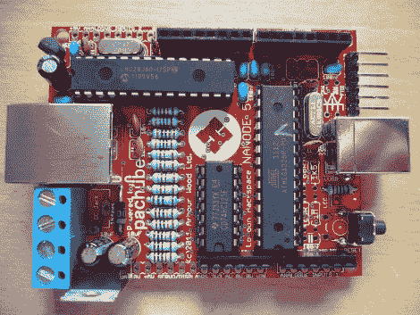

# Nanode:一种低成本的支持网络的 Arduino 以太网替代方案

> 原文：<https://hackaday.com/2011/08/11/nanode-a-low-cost-network-enabled-arduino-ethernet-alternative/>

伦敦 Hackspace 的人一直在努力创建一个“成本非常低、开源、互联网连接的平台，其他人可以在这个平台上开发他们的想法”，他们称之为“Nanode”。

本质上是一个板载以太网网络的 Arduino，Nanode 配备了 ATMega 328 微控制器以及所有其他标准的 Arduino 兼容设备。多亏了一些定制的以太网库，Nanode 可以通过开箱即用的网络浏览器进行控制。此外，Nanodes 网络可轻松配置为通过多点串行总线与“主”单元通信，从而使该器件可用于各种分布式控制任务。

显然，这些功能中的大部分可以通过 Arduino 以太网板的形式来实现，或者通过使用以太网屏蔽来实现。Nanode 比这两种选择都便宜一点，每套 40 美元，而且其固有的网络功能听起来非常方便。也就是说，我们有点失望，它只有 10BaseT 网络功能，尽管在选择微控制器板时有选择总是好的。

[谢谢，催眠师]