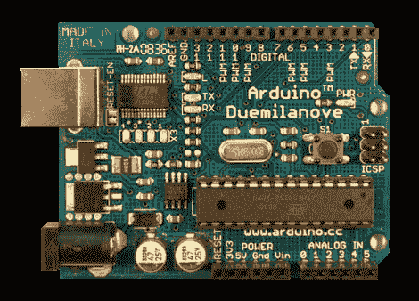

# Arduino 链接库

> 原文：<https://hackaday.com/2011/08/12/arduino-link-libraries/>

Arduino 很棒，但它有时会因其入门级的做事风格而碍事。一个限制是制作你自己的库，其中也包括其他库。[Scott]已经发送了一个很好的教程来解决这个问题。

他讲述了如何在现有库的基础上构建自己的定制库。这是 Arduino 的自动魔法碰不到的。他介绍了如何编译你的库，同时包含另一个库，链接与编译，以及如何将它们链接起来。

添加清晰的例子、大量的解释和一手 C 语言库的良好实践(比如前向类声明 vs Includes，以及使用括号 vs 引号进行 Includes)，这是一个任何有抱负的 AVR 或 Arduino 开发人员都应该看看的教程。