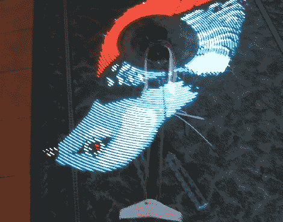

# 具有 RGB 发光二极管的视觉直升机桨叶的持久性

> 原文：<https://hackaday.com/2011/08/12/persistence-of-vision-helicopter-blades-with-rgb-leds/>

rcgroups 论坛上一个名为[BOcnc]的用户刚刚发布了他的 [RGB POV 直升机桨叶](http://www.rcgroups.com/forums/showthread.php?t=1461291)。

这两个叶片就像其他旋转翼一样安装在直升机上。然而，[电子设备](http://hackaday.com/wp-content/uploads/2011/08/blademount.jpg)安装在带有电池组的刀片下方。我们去年报道了一个建筑，展示了增加旋转叶片的重量不会撕裂一切，但那个建筑只使用了蓝色 led。这个建筑是全彩色的，让我们感觉我们生活在一个由[识别器](http://tron.wikia.com/wiki/Recognizer)和蠢朋克居住的赛博朋克未来。

图像存储在从 USB 端口接收数据的 SD 卡上。微控制器是 PIC32，从原理图中我们可以假设，叶片的转速是由板载霍尔效应传感器测量的(不过不要引用我们的话)。不过,[BOcnc]没有商业发行的希望。他找不到人来制造叶片，而且整个建造过程太过昂贵。虽然它看起来确实很漂亮，所以休息后看看它的视频。

 <https://www.youtube.com/embed/giHx48q3dpo?version=3&rel=1&showsearch=0&showinfo=1&iv_load_policy=1&fs=1&hl=en-US&autohide=2&wmode=transparent>

 </body> </html>