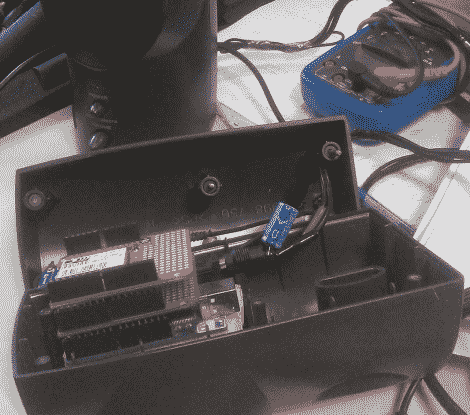

# 使用这些 WiFi 扬声器，您可以在家中的任何地方播放音乐

> 原文：<https://hackaday.com/2011/08/12/stream-music-anywhere-in-your-house-with-these-wifi-speakers/>

[Rui]需要一种简单的方法从一个集中的位置在几个不同的区域播放音乐，但他不想在这个过程中运行任何新的布线。

他认为最好的方法是通过以太网将他的音乐直接传输到他的扬声器。今年早些时候，他用几个配备了以太网和 MP3 屏蔽的 Arduinos 组装了几个以太网连接的扬声器节点。为了与这些扬声器节点交互，他利用 VLC 的网络流媒体引擎编写了一个应用程序。这个软件监控他的网络中新连接的扬声器，自动将它们添加到他的清单中。他可以选择使用多播音频流在任何一组扬声器上播放音乐。

设置非常巧妙，但是还没有以太网接入点的地方呢？他也想到了这一点，[最近刚刚修改了他的设计](http://supertechman.blogspot.com/2011/08/wifi-wireless-speakers-set.html)。他制作的最新一套扬声器抛弃了以太网板，变成了一个无线屏蔽，所有这些都被他塞进了音箱里。现在，他可以在任何他想去的地方播放音乐，不管那里有什么样的基础设施。

如果你需要在家里做这个，[芮]已经在他的网站上免费提供了他的软件，所以一定要拿到一份拷贝。

请继续阅读，观看演讲者的视频短片。

 <https://www.youtube.com/embed/xX8JxCu89JY?version=3&rel=1&showsearch=0&showinfo=1&iv_load_policy=1&fs=1&hl=en-US&autohide=2&wmode=transparent>

 </body> </html>