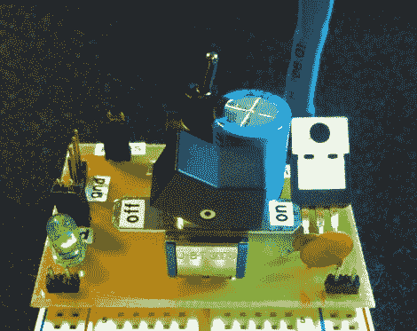

# Juice Bridge 可瞬间为您的试验板供电

> 原文：<https://hackaday.com/2011/08/13/juice-bridge-powers-your-breadboard-in-a-snap/>

[Quinn Dunki]厌倦了在将东西连接到她的台式电源时摆弄电线，所以[她为自己建造了一个有用的小电源桥](http://quinndunki.com/blondihacks/?p=374)，可以直接插入任何标准试验板。

这块板又小又简单，但仍然很有用。它为试验板的两面供电，可以在非稳压电源和稳压 5v 电源之间轻松切换。安培计可以通过她放在一边的一对引脚连接到电路板上，这样她就可以轻松地测量整个电路的电流消耗。

我们认为她的“果汁桥”对那些经常在试验板上制作原型的人来说非常有用。事实上，这将是一个奇妙的初学者项目，因为它涉及到蚀刻和开发印刷电路板以及一些简单的焊接，同时也是一个方便的工具。

如果你想自己制作一个，[Quinn]的网站上有原理图和 Eagle PCB 文件可供下载。