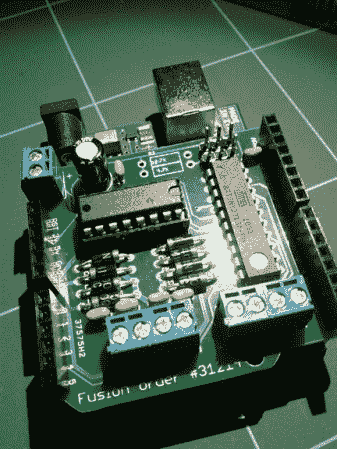

# 用于 Arduino 的可堆叠电机驱动器护罩

> 原文：<https://hackaday.com/2011/08/17/a-stackable-motor-driver-shield-for-the-arduino/>

Arduino 已经被用于许多目的，并且“护盾”可以使许多常见的任务变得更容易。然而，[Nick]想要一个可堆叠的电机驱动防护罩，所以他自己做了一个！。Arduino 有许多电机驱动屏蔽，但是，没有一个可以驱动他的项目所需的那么多电机，也没有一个可以堆叠。

[Nick]没有设计和制作定制板的经验，但决定尝试一下。有了免费版的[【Eagle】](http://www.cadsoftusa.com/)PCB 设计软件，他设计出自己需要的电路板，然后送到[【seed】](http://www.seeedstudio.com/depot/fusion-pcb-service-p-835.html?cPath=185)进行制造。根据他的文章，10 块 Arduino 大小的电路板可以以 25 美元的价格购买。在这个价位，一些爱好者可能会考虑这个选项，而不是手动创建自己的电路。

根据[Nick]的说法，他能够在第一次运行中制造出他的第一块电路板，没有任何错误！对于他第一次尝试这样的东西来说，还不错。