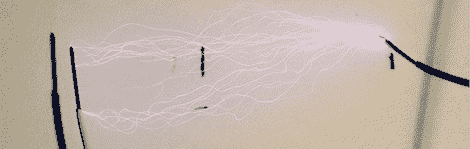

# 高压:用 Arduino 控制反激式变压器

> 原文：<https://hackaday.com/2011/08/21/controlling-a-flyback-transformer-with-an-arduino/>

如果你想建立一个雅各布的梯子，一个喷火器的点火系统，或者出于某种不虔诚的原因，你需要 15 千伏的道具复制品或角色扮演建筑，这是给你的。很容易构建与 Arduino 接口的[高压电源](http://reibot.org/easy-high-voltage-supply/)。

在从 CRT 的电源板上收获了一个反激后，[Andrew Moser]给变压器增加了一个新的初级线圈。这可以将 Arduino 容易控制的 12 伏电压提升到一英寸半的弧度。构建反激式驱动器的下一步。[Andrew]在这个电路中使用了 MOSFET 和 MOSFET 驱动器(尽管他说[这个家伙](http://www.sparkfun.com/products/10213)没有驱动器也能工作)。之后，剩下要做的就是写一些软件并测试它。

当然，这伴随着样板警告，“如果你不知道你在做什么，你可能会死。”也就是说，如果你想测试 Arduino 对电磁脉冲的抵抗力，这个项目正适合你。休息后，请查看为雅各布之梯供电的反激式电源。

 <https://www.youtube.com/embed/5xkHPWMX4Sw?version=3&rel=1&showsearch=0&showinfo=1&iv_load_policy=1&fs=1&hl=en-US&autohide=2&wmode=transparent>

 </body> </html>