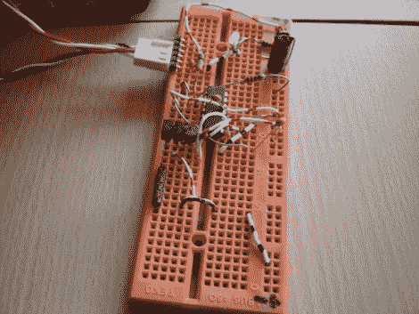

# 将 PWM 转换为 DC 信号，实现更精确的风扇控制

> 原文：<https://hackaday.com/2011/08/15/converting-pwm-to-dc-signaling-for-more-precise-fan-control/>

[hedgehoginventions]来信分享了他对视频卡所做的一点修改，以防止它在繁重的 3D 任务中过热。在更换了他的 Nvidia 9600GT 显卡上的股票冷却器后，他发现在做日常工作如检查电子邮件时不需要使用风扇，但在玩游戏时仍然需要额外的空气流动。

他想通过调整 PWM 信号来关闭风扇，但他发现使用软件无法获得 20%以下的占空比，这仍然会导致风扇一直运行。他构建的电路接收卡输出的 PWM 信号，在将其转换为相应的 DC 电压之前对其进行净化。然后，风扇以与直接由 PWM 信号驱动时相同的速度运行，尽管现在它可以在不需要时完全关闭。

当你无法关闭 GPU 风扇时，这是一个很好的自动控制风扇的方法。干得好！