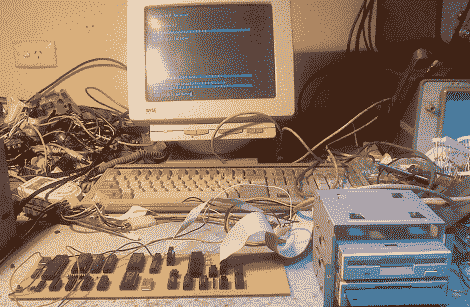

# 易于构建的 Z80 单板机

> 原文：<https://hackaday.com/2011/08/16/easy-to-build-z80-single-board-computer/>

[亚历克西斯]送来了他一直在做的一台单板电脑。他构建的项目目标是使其易于复制。从原理图来看，这是我们见过的最简单的全功能计算机之一。构建在两张 3.5 英寸软盘上运行 CP/M 2.2。这为已经可用的软件提供了很多选择。虽然它通过串行终端操作，但[亚历克西斯]几乎是[奥斯本一世](http://oldcomputers.net/osborne.html)的翻版，只是速度快了一倍。

[亚历克西斯]因为他早期的[8088 自制电脑](http://kaput.retroarchive.org/8088.html)而在网上小有名气，这台电脑是在 8088 早期从一家电子废品店抢救回来的。这些 8088 电脑通过使用来自 Commodore 64 的 [SID 芯片](http://www.youtube.com/watch?v=yLS35kyYlOU)和 [YM2151](http://www.youtube.com/watch?v=gBiIr-bFiKM) FM synth 芯片来播放【T2 还活着而在博客上流传开来。

目前，我想我们只能满足于[Alexis]的 Z80 计算机运行 CP/M 的视频。在他的计算机运行最伟大的 Infocom 冒险后，请查看视频，*银河系漫游指南*。

 <https://www.youtube.com/embed/inXlE3OC55c?version=3&rel=1&showsearch=0&showinfo=1&iv_load_policy=1&fs=1&hl=en-US&autohide=2&wmode=transparent>

 </body> </html>