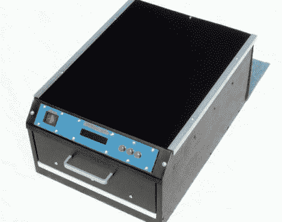

# DIY PCB 曝光盒看起来很专业

> 原文：<https://hackaday.com/2011/08/17/diy-pcb-exposure-box-looks-professionally-made/>

[Stynus]感到沮丧的是，他必须在曝光过程中翻转他的 PCB，所以他决定最好的行动是建立自己的双面 PCB 曝光箱。

他在易贝做了一些紫外线发光二极管，在等待多氯联苯到达几周后，他准备开始建设。盒子包含一个滑动玻璃搁板，位于两组 LED 面板之间。该装置可以让他同时蚀刻任何 PCB 的两面，尺寸最大为 20 厘米×30 厘米。曝光箱由 PIC 16F628P 运行，具有 LCD 状态面板和少量控件。[Stynus]对盒子进行了编程，以保留最后一次曝光的长度，从而很容易一次又一次地复制他的结果。

在构建日志的末尾，他展示了一些完成的曝光框的图片，看起来非常专业。这是一份很棒的工作，我们很乐意为我们的工作室做一份。