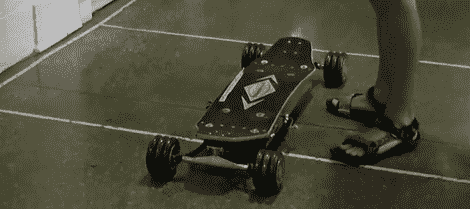

# 电动长板采用 DIY 轮毂电机

> 原文：<https://hackaday.com/2011/08/17/electric-longboard-uses-diy-hub-motors/>

作为一名麻省理工学院的学生，[杰德·斯托里]可以接触到大量的机床，所以他决定手工制作一个带有轮毂电机的电动长板。他最终重做了很多他的项目，所以我们可以同情他对研发的尝试

受 [BWD 滑板车](http://web.mit.edu/first/scooter/)的启发，【杰德】的长板使用轮毂电机——轮子*就是*电机。转子在内部制造，[现成的定子](http://www.gobrushless.com/shop/index.php?app=ccp0&ns=prodshow&ref=SC+65mmstator)由【杰德】[手工](http://mitrocketscience.blogspot.com/2010/05/elb-april.html)缠绕。在这个构建中做了很多工作，构建日志在这方面真的很吸引人。

该板由手枪式遥控控制器[控制，该控制器已经过修改](http://mitrocketscience.blogspot.com/2011/08/win.html)以包括一个开发板和一个 XBee。至于动力，一个铝制外壳被制造出来，绑在甲板下面，[装满了脂肪电池](http://mitrocketscience.blogspot.com/2011/06/weekly-update.html)。虽然构建已经基本完成，但[Jeb]正在考虑放弃它，转到第二版，也就是最重要的版本。查看电路板运行的[视频](http://s907.photobucket.com/albums/ac276/all1by/ELB/?action=view&current=ELBfirsttestrun.mp4)。