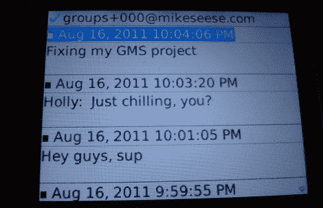

# 建立自己的短信聊天室

> 原文：<https://hackaday.com/2011/08/17/build-your-own-sms-chatroom/>

当他在组织一个聚会时，[Mike Seese]突然想到了一个可以通过短信操作的聊天室。不满足于“回复所有人”功能，[Mike]开发了一个在他的家庭服务器上运行的[群组消息服务](http://www.mikeseese.com/projects/group_messaging_service.php)。

通过向服务器发送文本来启动聊天室。然后你的朋友回复，聊天室就打开了。这个项目是用 C++写的，[Mike]把所有东西都放在了 [github](https://github.com/seesemichaelj/GMS) 上供你阅读。该软件确实使用了来自/n software 的 [IP*Works](http://www.nsoftware.com/ipworks/) 的库，但是如果你在获取这些库时有任何困难，请随时给【迈克】写信。

这个项目的伟大之处在于它是独立于平台的——只要手机能发送短信，它就能工作。对于我们这些仍在使用老式诺基亚“酒吧”手机的人来说，这似乎是一件好事。在 T1 之前已经有过短信聊天室，但是这是我们第一次看到一个建立在 T2 服务器上的聊天室，而不是基于互联网的服务。

虽然对于没有无限短信的人来说，这可能不是最好的主意，但这确实是一个好主意，我们想知道为什么这样的东西不能通过谷歌语音提供。