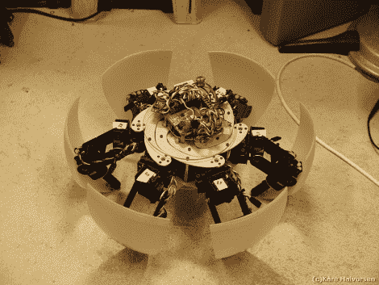

# 变形六足动物让我们垂涎三尺

> 原文：<https://hackaday.com/2011/08/18/morphing-hexapod-has-us-drooling/>

最近，六足机器人似乎多如牛毛，但我们认为你很难不对[品红]的最新创造感到惊叹。他以前建造过一堆六角和八脚机器人，但是[还没有尝试过建造这样的东西。](http://robot-kits.org/category/a-morphing-hexapod/)

他的 MorpHex 机器人可能看起来像你的标准六足机器人，但一旦它开始移动，你就会发现它非常独特。MorpHex 利用由单个 ARC-32 控制器驱动的超过 25 个伺服系统，以流畅的运动方式移动，使它看起来像是活的。身体的内部可以呈扇形展开，延长机器人的整体长度，尽管这更意味着允许机器人变形为一个球并返回，而不是增加它的大小。

在下面的预告视频中，你可以看到 MorpHex 在活动，它的各个部分更像水母而不是任何陆地动物。虽然[品红]还在继续研究 MorpHex 的球体变形能力，但我们认为它会成为一个令人敬畏和毛骨悚然的蜘蛛机器人！

[谢谢，威兹]

 <https://www.youtube.com/embed/bA9BlcwLlxM?version=3&rel=1&showsearch=0&showinfo=1&iv_load_policy=1&fs=1&hl=en-US&autohide=2&wmode=transparent>

 </body> </html>