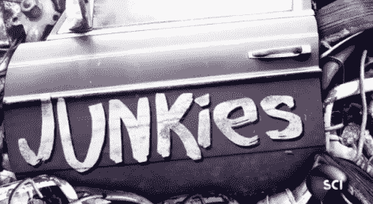

# 垃圾箱黑客和垃圾场制造者得到了他们自己的电视节目

> 原文：<https://hackaday.com/2011/08/17/dumpster-hackers-and-junkyard-makers-get-their-own-tv-show/>

科学频道有一个新节目将在明晚首播，我们认为你不会想错过的。

《瘾君子》讲述了由[垃圾天才吉米·鲁科]领导的一群垃圾场工程师，他也是垃圾场的老板。从下面的预告片中，你可以看到，这部剧看起来将会非常有趣，结合了垃圾场大战、流言终结者、甚至是《蠢驴》的精华部分——有着令人捧腹的有趣结果。

该节目包括[吉米]和他的工作人员拼凑的疯狂的东西，以及来商店寻找零件的个人创作。当工作人员不忙着制造疯狂的机器时，他们似乎更乐意帮助随机的发明家和制造商为他们的项目挖掘出合适的零件。

该节目将于 8 月 18 日晚东部时间 10 点播出，所以一定要去看看，并让我们知道你的想法！

[通过[使](http://blog.makezine.com/archive/2011/08/junkies-a-new-maker-show.html)