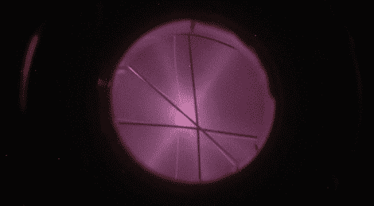

# 高压黑客:转化你车库中的元素

> 原文：<https://hackaday.com/2011/08/27/high-voltage-hacks-transmute-the-elements-in-your-garage/>

炼金术的代表作是魔法石，一种能够将普通金属变成黄金的物质。与炼金术士不同，[卡尔·威利斯]可能不会以多种方式毒害自己，但他确实建造了一个能够将氢转化为氦的[法恩斯沃思·福索尔](http://carlwillis.wordpress.com/2008/02/17/farnsworth-fusor-carls-jr/)。

为了在他的装置中融合氢，[卡尔]首先抽空真空室。氘(添加了中子的氢)被注入腔室，由钨制成的[球形阴极](http://carlwillis.files.wordpress.com/2008/02/lower.jpg)被充电至 75 kV。氘气被阴极加热和限制，并融合成氦。等离子体的静电限制与一些旧的阴极射线管没有太大的不同。这不是巧合 fusor 和 CRT 都是由[同一个人](http://en.wikipedia.org/wiki/Philo_Farnsworth)发明的。

虽然没有聚变实验——包括一些[十亿美元的实验](https://lasers.llnl.gov/)——产生过净能量增益，但这并不意味着这不是一个令人印象深刻的工程壮举。如果你想尝试建造自己的 fusor，请访问异常活跃的[研究论坛](http://www.fusor.net/board/index.php?site=fusor)。那边有很多[非常好的项目](http://www.fusor.net/board/view.php?bn=fusor_images&key=1304857808)可以去看看。