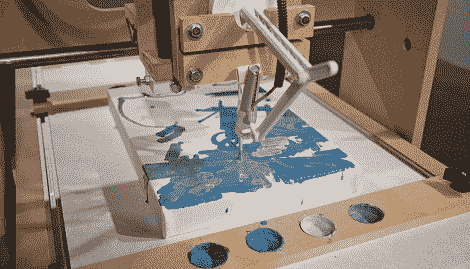

# 机器人艺术家倾听你的批评

> 原文：<https://hackaday.com/2011/08/18/robotic-artist-listens-to-your-criticism/>

[Ben Grosser]建造了一个[交互式绘画机器人](http://bengrosser.com/projects/interactive-robotic-painting-machine/)，它与我们通常看到的 LED 和 Arduino 版本相去甚远。这个机器人改编自我们多年来推出的[多台](http://hackaday.com/2009/12/29/cnc-project-roundup/)数控路由器中的[一台](http://hackaday.com/2011/06/07/diy-bolt-together-cnc-router/)。控制系统是用 Python 编写的，使用遗传算法和一个麦克风来决定下一步要画什么。

机器人艺术家已经存在几十年了。当哈罗德·科恩展出他的机器人艺术家 T2·亚伦时，画廊的顾客排队观看机器人绘画。[这些画](http://collections.vam.ac.uk/item/O499577/drawing-amsterdam-suite-amsterdam-suite-a/)最初只是单色线条画，后来由【科恩】着色。[Ben]让他的机器人直接用油画颜料在画布上作画，所以不存在计算机想要最终产品是什么的问题。

[Ben]想出了一个非常整洁的建筑，但我们想让这个机器人艺术家在一个洞穴般的展厅里展出。当然，来自伺服系统和步进电机的回声会被麦克风拾取，并被绘画算法解释。除了一些控制系统，它很可能是机器人对自己的评论[体面进入疯狂](http://www.youtube.com/watch?v=Vkv6VwWEZyg)。

休息之后，看看机器人的视频，然后是小提琴/机器人二重奏，展示音频是如何解读的。

<https://player.vimeo.com/video/23998286>

 
<iframe src="https://player.vimeo.com/video/27759330" width="800" height="480" frameborder="0" webkitallowfullscreen="" mozallowfullscreen="" allowfullscreen=""/>
 </body> </html>