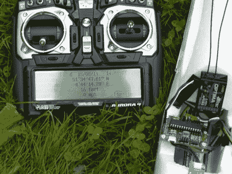

# DIY RC 传感器板

> 原文：<https://hackaday.com/2011/08/18/diy-rc-sensor-board/>

除了爱好电子产品，驾驶遥控飞机也是 Diederich 最喜欢的爱好之一。当在野外时，他更喜欢使用 Aurora 9 无线电控制器，虽然遥控器很棒，但他对 Hitec 的遥测传感器系列有点失望。他说，传感器相当不错，尽管有限，而且[他确信他可以建立一个更好的遥测解决方案](http://www.d68.nl/sensorboard/index.html)。

他的传感器板是完全开源的，有一长串的特性。首先也是最重要的，它模拟了 Hitec 的现成模型可以发送到无线电控制器的所有消息，使它成为一个简单的替代产品。他使用 ATMega8L 微控制器来运行这个节目，包括各种输入引脚和连接器来支持 GPS 以及电压和电流监控。

他制作了一个 DIY 工具包，可以在网上购买，但是所有传感器的原理图和 BOM 都是免费的，如果你想自己制作的话。

我们喜欢看到 DIY 者以这种方式展示制造商，尤其是当他们与其他爱好者分享产品时。干得好！