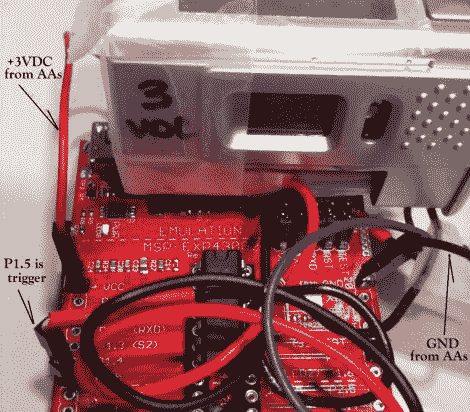

# 使用 MSP430 进行延时摄影

> 原文：<https://hackaday.com/2011/08/19/using-an-msp430-for-time-lapse-photography/>

Hackaday reader [onefivefour]有一个旧的 VistaQuest VQ1005 钥匙链相机，他想用它做一些有用的事情。不久前，他连接了一个 555 定时器，做了一点延时摄影，但他希望对这个过程有更多的控制。具体来说，他希望能够以更精细的方式调整拍摄之间的延迟，以及防止 VistaQuest 在闲置 60 秒后进入睡眠状态的方法。

他选择 MSP430 作为完成这项任务的武器，因为这种微控制器很便宜，而且相对容易使用。他在 LaunchPad 板上添加了一些插头，将它们连接到相机的触发器和开关上。当连接到触发器的导线被拉低时，相机就拍摄一张照片。连接到开/关开关的电线总是保持在低位，确保相机打开，随时准备拍摄。

这是一个相对简单的项目，但绝对有用。虽然有许多方法可以构建 intervalometer，但 MSP430 是一个很好的使用平台，尤其是对初学者而言。

留下来看看一个快速的视频[onefivefour]放在一起，炫耀他的定时装置的能力。

 <https://www.youtube.com/embed/mBQEt9WRtK8?version=3&rel=1&showsearch=0&showinfo=1&iv_load_policy=1&fs=1&hl=en-US&autohide=2&wmode=transparent>

 </body> </html>