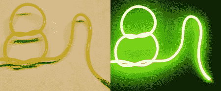

# 高压黑客:所有关于电致发光

> 原文：<https://hackaday.com/2011/08/25/all-about-electroluminescence/>

虽然许多人可能不知道，[电致发光](http://en.wikipedia.org/wiki/Electroluminescence)材料使用高电压，因此符合我们的专题。许多人可能会认为这些薄片的工作方式与 LED 灯相同，使用低压 DC 电源。然而，事实并非如此，因为它们需要大约 100 伏的交流电来点亮。

对于电池供电的解决方案，这意味着将电池的 DC 电源转换为交流电。Adafruit 有一个很好的教程，教你如何使用 EL 电线，以及如何使用便携式逆变器给它供电。很明显，人们应该小心使用这种材料来适当地隔离任何衣服，因为受到电击通常并不好玩。

休息后的视频很长，但制作精良，会给你一个很好的 EL 使用背景。如果你没有 30 分钟的时间来做这件事，一定要至少跳到 2:43 来看看我们见过的最酷的 EL 衫之一。

 <https://www.youtube.com/embed/_QfV-ygFL_M?version=3&rel=1&showsearch=0&showinfo=1&iv_load_policy=1&fs=1&hl=en-US&autohide=2&wmode=transparent>

 
对于另一个相关的黑客，请查看[Jeri Ellsworth]的这篇关于制作 EL ink 的文章。
 </body> </html>