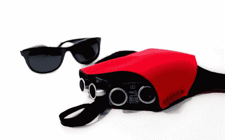

# 该手持式触觉反馈声纳避障辅助装置..还是心照不宣

> 原文：<https://hackaday.com/2011/08/19/the-hand-mounted-haptic-feedback-sonar-obstacle-avoidance-asstance-device-or-the-tacit/>

这是一个从盲人手里拿走棍子的方法。[史蒂夫]一直在研究[默契](http://grathio.com/2011/08/meet-the-tacit-project-its-sonar-for-the-blind/ "main link")，一种带触觉反馈的腕戴声纳设备，它就像在你的手腕上绑一只蝙蝠来帮助你看东西。“心照不宣”使用两个声纳 ping 传感器来测量到最近障碍物的距离，然后使用两个伺服系统将到物体的相对距离反馈给用户，这两个伺服系统将压力施加到手腕的背部。“心照不宣”配备了一台 Arduino pro mini 来控制 ping 传感器和驱动伺服系统，并使用 9 伏电池。

这并不是一个全新的概念，[触觉头带](http://www.instructables.com/id/Haptic-Feedback-device-for-the-Visually-Impaired/ "headband")已经在网上出现了一段时间，但这种默契允许用户检测地面上等待绊倒你的障碍物。总的来说，这是一个巧妙的方法，可能会在帮助盲人方面有前途。休息之后，请观看视频，了解实际情况。

<https://player.vimeo.com/video/27675622>

 </body> </html>