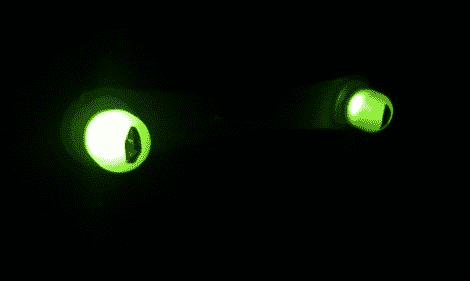

# 发光眼睛项目让这个万圣节变得简单

> 原文：<https://hackaday.com/2011/08/20/glowing-eyes-project-keeps-it-simple-this-halloween/>

万圣节就要到了，我们想提醒你早点开始，这样你就可以向我们展示今年你为孩子们准备了什么。[皮特]已经完成了一个简单的项目，增加了他家门前灌木丛的味道。他那三只发光闪烁的眼睛会给他家门前的灌木丛增添一抹亮色。每个都是由一对安装在冰棒棍上的超大尺寸发光二极管制成的。将导线穿过木头上的孔后，将它们焊接到一些电阻和 cat-5 电缆上。导线覆盖有热胶，以帮助防止潮湿，然后它们准备好由 ATtiny2313 驱动，ATtiny2313 使用随机数来帮助确保闪烁看起来不是定时的。休息后看看视频，看看他做得怎么样。

这是一个很好的例子，你不必承担世界上最复杂的项目就能得到赞赏。但是，如果你希望在未来的岁月里被人记住，你可能希望设立一个目标，比如建造一个垃圾桶杰克箱或者呕吐的海盗 T2。

 <https://www.youtube.com/embed/TdCPrMGrst0?version=3&rel=1&showsearch=0&showinfo=1&iv_load_policy=1&fs=1&hl=en-US&autohide=2&wmode=transparent>

 </body> </html>