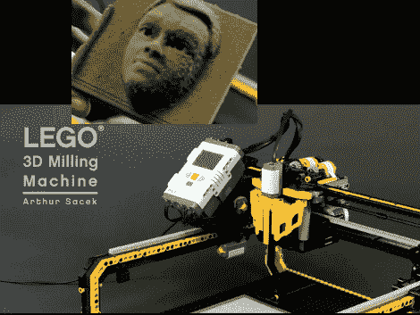

# 乐高工厂生产分辨率极高的雕塑模型

> 原文：<https://hackaday.com/2011/08/20/lego-mill-produces-sculpted-models-with-fantastic-resolution/>

[亚瑟·萨切克]完全用乐高积木建造的 [3D 磨坊真的很棒。如你所见，它使用 NXT 部件沿三个轴控制刀头。充当磨机切割头的钻头不是乐高零件，但那是[亚瑟]唯一的过失。](http://www.youtube.com/watch?v=pX1cO2XhMrg)

上面看到的演示雕塑被切割成一块花卉泡沫。该模型由 Autodesk Softimage 处理，然后送入工厂，在那里完成这项工作需要大约两个半小时。泡沫仍然以块状形式出现，看起来像一块室外地毯。这是因为在铣削过程中没有清除碎屑。但是用购物吸尘器敲击它，你会发现一个有着惊人细节的物理模型。我们不认为它接近我们见过的光固化树脂印刷，但如果你正在做一些模具制作，它将是一个很大的资产。

休息后不要错过[Arthur]的铣削过程视频。

 <https://www.youtube.com/embed/pX1cO2XhMrg?version=3&rel=1&showsearch=0&showinfo=1&iv_load_policy=1&fs=1&hl=en-US&autohide=2&wmode=transparent>

 </body> </html>