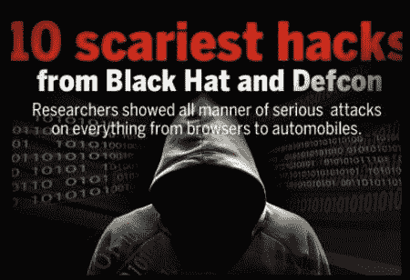

# 来自黑帽和 Defcon 的最恐怖的黑客

> 原文：<https://hackaday.com/2011/08/24/the-scariest-hacks-from-black-hat-and-defcon/>

虽然[HAD]通常都是关于合法黑客的，但这个列表中的[展示的黑客](http://www.cso.com.au/slideshow/397747/10_scariest_hacks_from_black_hat_defcon_/?image=1)也可以用于黑暗面。希望通过展示这样的黑客行为，大多数人能够更加清楚他们是如何使用他们的信息的。计算机安全专家也有机会磨练他们的技能，看看潜在的漏洞在哪里。

这篇文章中的一些亮点包括黑客攻击西门子 S7 PLC，它可以用于工厂自动化，我们之前介绍过的[“黑客无人机”](http://hackaday.com/2011/08/01/wasp-uav-gets-some-new-toys-now-intercepts-your-phone-calls-too/)，以及从社交网站上的个人照片推断某人的社会安全号码的方法。同样可怕的是关闭某些个人胰岛素泵的方法。尽管这本身很严重，但人们还是希望其他救生设备能够得到充分保护，免受入侵。

在合法黑客世界中，一个看起来可能有有趣用途的黑客是 VoIP 僵尸网络控制的想法。虽然“僵尸网络控制”明显暗示着非法使用，但通过语音或按键控制电脑可以而且确实有很多合法用途。