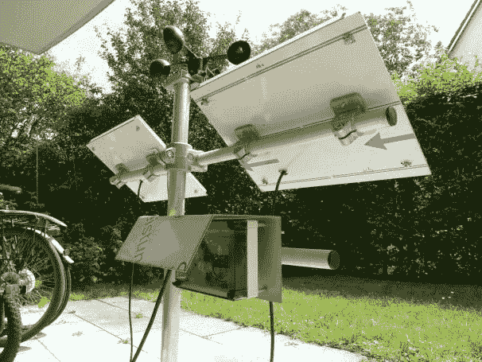

# 家酿气象站加上一个云台摄像机

> 原文：<https://hackaday.com/2011/08/20/homebrew-weather-station-plus-a-pan-and-tilt-camera-rig/>

[Sebastian]写来分享他的网站，那里有一堆不同的电子项目。看完之后，我们找到了一双，我们认为你可能会感兴趣。

第一个项目是[塞巴斯蒂安]组装的自制气象监测站。他设计了一个天气防护罩，结合了湿度、压力和光线传感器，以及用于监控风速计的数字 I/O 端口。整个装置使用太阳能电池板供电，数据通过 Xbee 传输到他的电脑。

引起我们注意的第二件物品是一个数码相机云台。该系统使用 Lynxmotion 云台套件构建，由 Arduino 控制。他提供的代码允许他捕捉非常大的合成图像，而不必花太多时间将它们“缝合”在一起。虽然这第二个项目主要由基板和平移/倾斜代码的示意图组成，但它给我们的印象是，对于任何希望拍摄全景照片的初露头角的摄影师来说，它可能非常有用。

他的项目的所有原理图和代码都可以在他的网站上找到，所以一定要四处看看——你可能会发现一些有趣的东西！