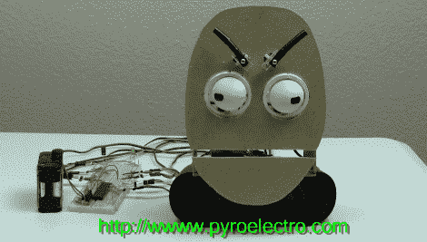

# 基础动画学续:伺服驱动嘴

> 原文：<https://hackaday.com/2011/08/21/basic-animatronics-continued-servo-actuated-mouth/>

[克里斯]又开始了，这次他整理了一个教程，通过启动嘴来完善他的电子脸。他的教程涵盖了两种不同类型的机器人嘴部:一种是 LCD 嘴部，通过变暗来暗示动作，另一种是伺服关节式口盖。

[Chris]涵盖了每种嘴型的所有方面，从人类嘴部动作的基础到伺服电机控制。在这种情况下，LCD 口不太令人印象深刻，所以它被安装在一个面部模型上，而伺服口则安装在他之前的其他教程中的面部上。整个设置仍然使用一个 PIC 18F452 控制。这两种类型的嘴的电路图和代码都可以在网站上找到，包括驱动嘴的视频和 LCD 嘴在运行的 gif。

看看下面的一段视频，展示了第六季中吉恩-吕克的嘴型。如果你对脸的其他部分感兴趣，我们已经介绍了克里斯关于眉毛和 T2 眼球的其他教程。这些是你自己的电子动画脸项目的一个很好的切入点，并且很好地设置了你需要如何建立自己的情感木偶的所有知识。

[https://www.youtube.com/embed/KgCbQvBw-Bc?version=3&rel=1&showsearch=0&showinfo=1&iv_load_policy=1&fs=1&hl=en-US&autohide=2&wmode=transparent](https://www.youtube.com/embed/KgCbQvBw-Bc?version=3&rel=1&showsearch=0&showinfo=1&iv_load_policy=1&fs=1&hl=en-US&autohide=2&wmode=transparent)