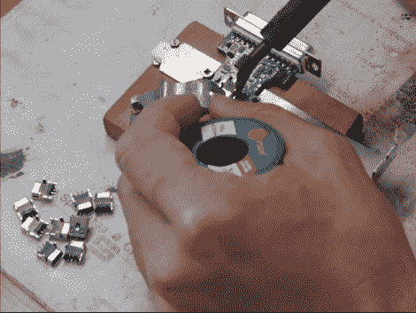

# 一个人的 SMD 装配线分享了许多正确操作的技巧

> 原文：<https://hackaday.com/2011/08/21/one-man-smd-assembly-line-shares-a-lot-of-tips-about-doing-it-right/>

需要使用只能通过并行端口连接的过时硬件吗？你可能需要一段时间才能找到一台仍有这种功能的电脑，或者你可以试试这个 [USB 转并行端口转换器](http://www-user.tu-chemnitz.de/~heha/bastelecke/Rund%20um%20den%20PC/USB2LPT/ul-17.htm.en)。它不仅限于使用打印机，因为驱动程序构建了一个虚拟并行端口，您可以将它用于任何目的。但是我们真正感兴趣的不是转换器本身，而是构建过程。[Henrik Haftmann]发布了一个关于组装过程的三部分系列视频，您可以在休息后观看。

构建主要是表面贴装焊接，只有少数组件需要手工焊接。他的第一个视频显示他在电路板上刷锡膏。从我们所能看到的来看，他用与 PCB 厚度相匹配的废覆铜片做了一个很好的夹具，并把它和模板牢牢地固定住。你可以从视频中收集到很多其他的技巧，比如上面的图片。这是一个夹具，在焊接时将 PCB 和 USB 插孔固定在一起。

如果你正在考虑组装一堆木板，你应该留出 30 分钟来观察它们。

 <https://www.youtube.com/embed/Fv2mEQS7awE?version=3&rel=1&showsearch=0&showinfo=1&iv_load_policy=1&fs=1&hl=en-US&autohide=2&wmode=transparent>

 <iframe class="youtube-player" width="800" height="480" src="https://www.youtube.com/embed/KU3grl6Nu2U?version=3&amp;rel=1&amp;showsearch=0&amp;showinfo=1&amp;iv_load_policy=1&amp;fs=1&amp;hl=en-US&amp;autohide=2&amp;wmode=transparent" allowfullscreen="true" style="border:0;" sandbox="allow-scripts allow-same-origin allow-popups allow-presentation"/> <iframe class="youtube-player" width="800" height="480" src="https://www.youtube.com/embed/M1rduCG0QLY?version=3&amp;rel=1&amp;showsearch=0&amp;showinfo=1&amp;iv_load_policy=1&amp;fs=1&amp;hl=en-US&amp;autohide=2&amp;wmode=transparent" allowfullscreen="true" style="border:0;" sandbox="allow-scripts allow-same-origin allow-popups allow-presentation"/> 
[Thanks Panikos]
 </body> </html>