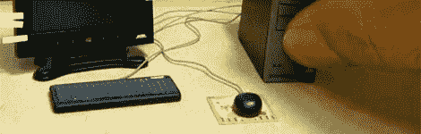

# 黑客日链接:2011 年 8 月 21 日

> 原文：<https://hackaday.com/2011/08/21/hackaday-links-august-21-2011/>

**Arduino + PS2 控制器+ R2D2**

这是一个令人难以置信的逼真的 R2D2 复制品，由 PS2 控制器驱动，内部有一个 Arduino，可以播放电影中的声音。可惜我们找不到更多的细节。[谢谢比尔]

**服务器构建延时**

[Justin]和他的同事花了五天时间通过构建一个 29 单元的集群来升级他们的服务器。幸运的是，他们设置了一个网络摄像头来捕捉这个过程。

**蟑螂电脑**

请看这台工作台式电脑，配有显示器和鼠标。我们不知道它是怎么做的，也不知道它是做什么用的，但仅仅因为它的大小就值得一瞥。[通过 [Dvice](http://dvice.com/archives/2011/08/insanely-tiny-d.php) 感谢哈拉尔德]

**模拟自组装病毒**

一台 3D 打印机和磁铁被用来构建这个自我组装病毒的模型。摇动罐子，它就散架了。再多摇一摇，它就会自己重建…它有技术。

**Tardis 袖扣**

[西蒙]正在用这些 [Tardis 袖扣](http://www.asciimation.co.nz/bb/2011/08/15/tardis-cufflinks)练习他的极客风格。激发配饰灵感的医生是由铁路电话亭模型制成的。