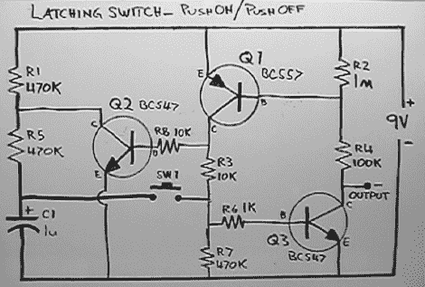

# [Dino]告诉我们基于晶体管的开关

> 原文：<https://hackaday.com/2011/08/22/dino-tells-us-about-transistor-based-onoff-switches/>

你知道它们，你爱它们，你认为它们是理所当然的——它们是[单按钮开/关开关](http://hackaweek.com/hacks/?p=344)。正如[Dino]在他的 Hack a Week 系列的最新一集中解释的那样，如今它们通常以 IC 逻辑开关的形式实现，但过去并不总是这样。当他们在 70 年代首次出现时，单按钮软开关是使用一组晶体管和一个电容器来完成工作的，所以[Dino]决定研究一下推上/推下晶体管开关，并制作自己的开关。

看完[一小段教程](http://talkingelectronics.com/projects/200TrCcts/101-200TrCcts.html#20a)后，他准备出发了。正如他在视频中解释的那样，开关的操作相当简单，尽管他在一块试验板上制作开关原型时遇到了一些奇怪的问题。他正在找人解释为什么在电池正极引线和电路输出之间增加一个小电容后，不稳定的电路突然表现得更好，所以如果你有一些见解，一定要在评论中说出来。

与此同时，请查看下面的[Dino]对推进/推出开关的探索。

 <https://www.youtube.com/embed/I70H5xQ6MT0?version=3&rel=1&showsearch=0&showinfo=1&iv_load_policy=1&fs=1&hl=en-US&autohide=2&wmode=transparent>

 </body> </html>