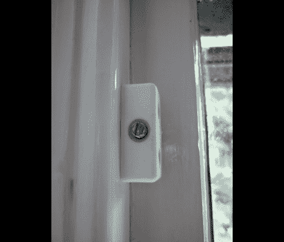

# 防寒:把风挡在双层窗户外面

> 原文：<https://hackaday.com/2011/08/23/winterizing-keeping-the-drafts-out-of-double-hung-windows/>

[侏儒怪]对他的双悬窗户进行了处理，以帮助防止通风并保持良好的工作状态。但是仍然有一些在冬天的寒冷中格格作响。今年不会；他在门框上增加了一个小功能，可以抵御寒冷的天气。

每个窗户上都加了一对接合块。上面看到的小块是用几个通用的螺丝固定在窗框上的，上面有一个指向窗框的机器螺丝。由于两个窗框之间以及窗框和外边框之间有挡风雨条，拧紧这个螺钉将使窗框紧密贴合，以封闭任何小间隙。这有一个意想不到的后果，禁止窗户被打开(除非你不介意当机器螺丝滑过木头时刮掉油漆)。但如果只在冬季使用，这是一个可行的解决方案。